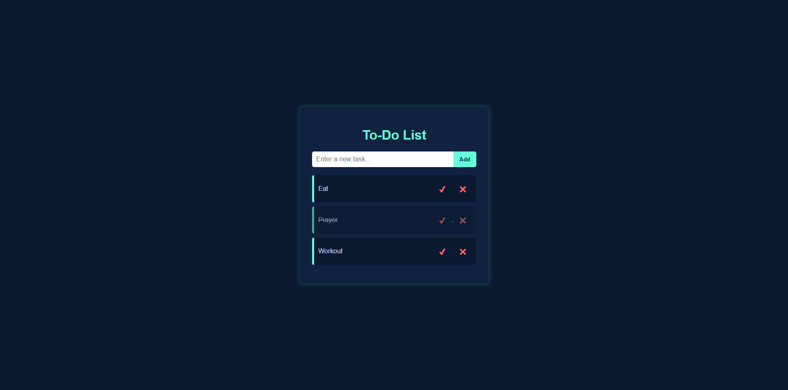

# ✅ Todo App

A simple Todo List application built using **HTML, CSS, and JavaScript**.  
This project helps manage tasks in the browser with a clean and simple interface.  

---

## 🚀 Features
- ➕ Add new tasks  
- 📋 View all tasks instantly  
- ❌ Delete tasks  
- 💾 Tasks saved in localStorage (persists even after closing browser)  

---

## 📸 Screenshot
*(Add a screenshot of your Todo App running in the browser here)*  



---

## 🔧 How to Run
1. Clone the repo  
   ```bash
   git clone https://github.com/danialshuib/todo-app.git
   cd todo-app

   🔗 **Live Demo:** [Todo App](https://danialshuib.github.io/todo-app/)

